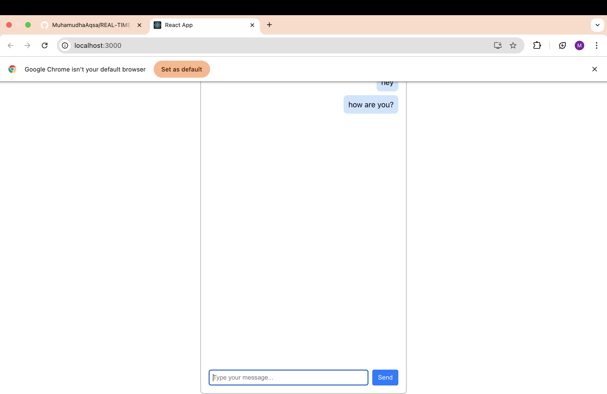

# REAL-TIME CHAT APPLICATION

COMPANY: CODTECH IT SOLUTIONS

NAME: MUHAMUDHA AQSA M A

INTERN ID: CT6WWRN

DOMAIN: FRONT END DEVELOPMENT

DURATION: 6 WEEKS

MENTOR: NEELA SANTOSH

# DESCRIPTION

An elegant and subtle front-end chat interface built with **React**. Messages are displayed instantly in a chat window with smooth scrolling and a responsive layout.

This app demonstrates key React concepts like `useState`, `useEffect`, and `useRef`.

This is a real-time chat application built with a strong focus on simplicity, responsiveness, and ease of use.

The application allows users to exchange messages instantly in a shared chat environment without requiring page reloads.

It is developed using modern frontend technologies to ensure smooth interaction and user satisfaction.

The interface includes a message input field, a scrollable chat window for viewing message history, and a clear send button.

As soon as a message is submitted, it appears in the chat interface for all connected users in real time.

The chat layout is programmed to automatically scroll to the latest message, ensuring users do not miss ongoing communication.

The design is fully responsive, allowing the chat to function seamlessly on desktops, tablets, and mobile devices of varying screen sizes.

The messaging experience is fluid and intuitive, allowing users to type and send messages effortlessly.

Users can send messages either by pressing the Enter key or by clicking the dedicated send button.

The real-time nature of the chat enhances engagement, making the experience lively and interactive.

The layout is intentionally minimal and distraction-free, allowing users to focus entirely on the conversation.

No user registration or login process is required, ensuring quick access and ease of use for all participants.

The platform is well-suited for casual conversations, collaborative discussions, remote learning, or basic team communication.

This chat application supports core functionality and provides a reliable starting point for further development if desired.

The folder structure and codebase are kept clean and straightforward, making it accessible even to new developers.

Styling choices have been made to reflect a modern, user-friendly look while maintaining clarity and professionalism.

The consistent layout and behavior across different devices help make the experience reliable and predictable.

Users can interact with the application immediately without needing external instructions.

This project can be used as a base for learning about real-time communication or for experimenting with frontend features.

The application delivers a balanced mix of usability, performance, and simplicity.

It serves as a functional, visually clean, and technically sound example of a real-time communication interface.

Developers can build upon this foundation to add enhancements like notifications, media sharing, or message persistence in future updates.

Overall, this project demonstrates how a simple and focused real-time chat application can be built efficiently using modern web technologies.

## OUTPUT

